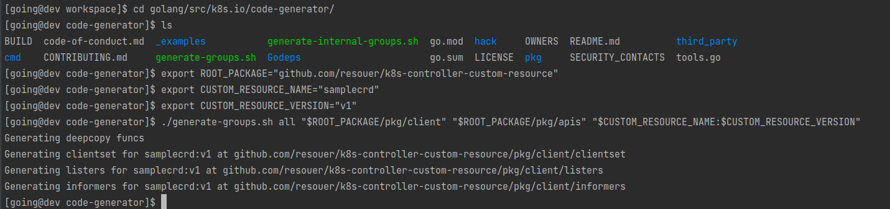
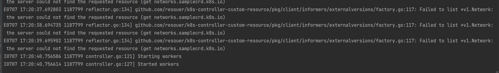
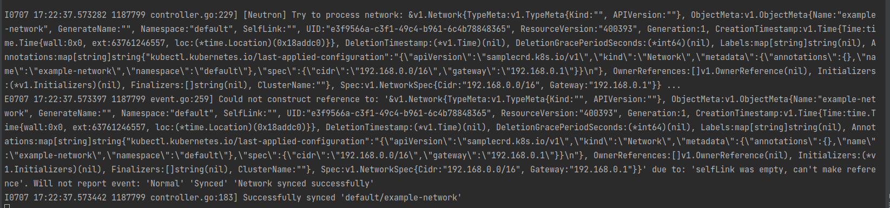
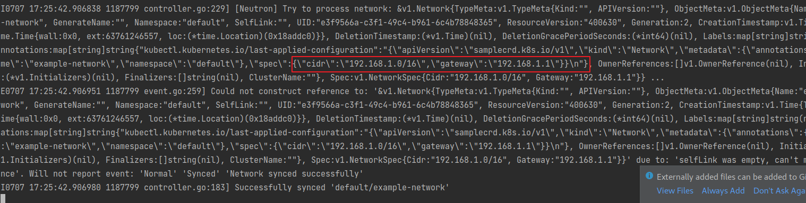
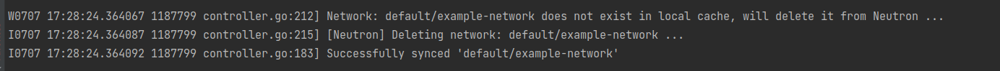

# Kubernetes Custom Controller - Custom Resource Handling

**Note**: the source code is _verbosely_ commented, so the source is meant to be read and to teach

## What is this?

An example of a custom Kubernetes controller that's only purpose is to watch for the creation, updating, or deletion of all custom resource of type `Network` (in the all namespaces). This was created as an exercise to understand how Kubernetes controllers work and interact with the cluster and resources.

## Running

Clone repo:

```
$ git clone https://github.com/resouer/k8s-controller-custom-resource
$ cd k8s-controller-custom-resource
```

Prepare build environment:

```
$ go get github.com/tools/godep
$ godep restore
```

Build and run:

```
$ go build -o samplecrd-controller .
$ ./samplecrd-controller -kubeconfig=$HOME/.kube/config -alsologtostderr=true
```

You can also use `samplecrd-controller` to create a Deployment and run it in Kubernetes. Note in this case, you don't need to specify `-kubeconfig` in CMD as default `InClusterConfig` will be used.

## Usage

You should create the CRD of Network first:

```
$ kubectl apply -f crd/network.yaml
```

You can then trigger an event by creating a Network API instance:

```
$ kubectl apply -f example/example-network.yaml
```

CURD the Network API instance, and check the logs of controller. 

Enjoy!


```
@20210707

go version 1.13.15   if 1.16 will has some problem: "no required module provides package"

# 代码生成的工作目录，也就是我们的项目路径
$ export ROOT_PACKAGE="github.com/resouer/k8s-controller-custom-resource"

# API Group
$ export CUSTOM_RESOURCE_NAME="samplecrd"
# API Version
$ export CUSTOM_RESOURCE_VERSION="v1"

# 直接复制到这个 目录  k8s.io/code-generator
$ cd $GOPATH/src/k8s.io/code-generator

# 执行代码自动生成，其中pkg/client是生成目标目录，pkg/apis是类型定义目录
$ ./generate-groups.sh all "$ROOT_PACKAGE/pkg/client" "$ROOT_PACKAGE/pkg/apis" "$CUSTOM_RESOURCE_NAME:$CUSTOM_RESOURCE_VERSION"

```



```  

# Clone repo
$ git clone https://github.com/resouer/k8s-controller-custom-resource$ cd k8s-controller-custom-resource

### Skip this part if you don't want to build
# Install dependency
$ go get github.com/tools/godep
$ godep restore
# Build
$ go build -o samplecrd-controller .

$ ./samplecrd-controller -kubeconfig=$HOME/.kube/config -alsologtostderr=true
I0915 12:50:29.051349   27159 controller.go:84] Setting up event handlers
I0915 12:50:29.051615   27159 controller.go:113] Starting Network control loop
I0915 12:50:29.051630   27159 controller.go:116] Waiting for informer caches to sync
E0915 12:50:29.066745   27159 reflector.go:134] github.com/resouer/k8s-controller-custom-resource/pkg/client/informers/externalversions/factory.go:117: Failed to list *v1.Network: the server could not find the requested resource (get networks.samplecrd.k8s.io)
...

[root@dev k8s-controller-custom-resource]# kubectl apply -f crd/network.yaml
Warning: apiextensions.k8s.io/v1beta1 CustomResourceDefinition is deprecated in                                                                  v1.16+, unavailable in v1.22+; use apiextensions.k8s.io/v1 CustomResourceDefinit                                                                 ion
customresourcedefinition.apiextensions.k8s.io/networks.samplecrd.k8s.io created


```



kubectl apply -f example/example-network.yaml



可以看到，我们上面创建 example-network 的操作，触发了 EventHandler 的“添加”事件，从而被放进了工作队列。
紧接着，控制循环就从队列里拿到了这个对象，并且打印出了正在“处理”这个 Network 对象的日志。

可以看到，这个 Network 的 ResourceVersion，也就是 API 对象的版本号，是 479015，而它的 Spec 字段的内容，跟我提交的 YAML 文件一摸一样，比如，
它的 CIDR 网段是：192.168.0.0/16。这时候，我来修改一下这个 YAML 文件的内容，如下所示：

update

``` 

$ cat example/example-network.yaml 
apiVersion: samplecrd.k8s.io/v1
kind: Network
metadata:
  name: example-network
spec:
  cidr: "192.168.1.0/16"
  gateway: "192.168.1.1"
```
可以看到，我把这个 YAML 文件里的 CIDR 和 Gateway 字段修改成了 192.168.1.0/16 网段




delete 

kubectl delete -f example/example-network_2.yaml




